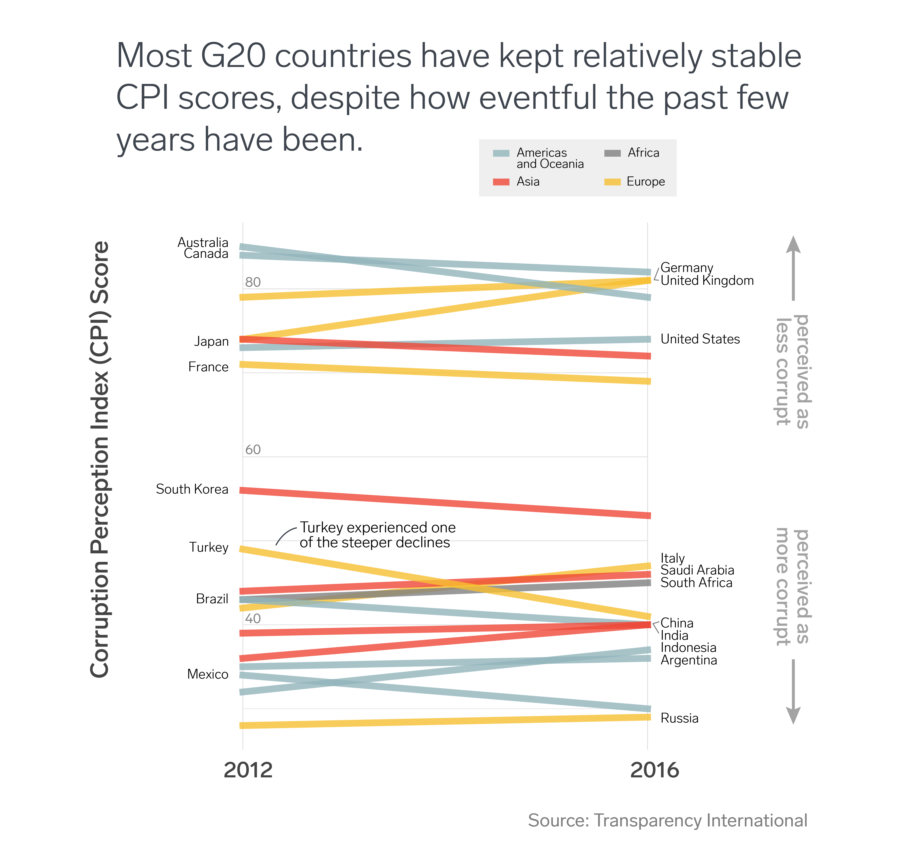

  

# WiMLDS NYC:  October 2018 Newsletter (Part 2)

## OUR MISSION

WiMLDS's mission is to support and promote women who are practicing, studying or interested in the fields of machine learning and data science.  We create opportunities for women to engage in technical and professional conversations in a positive, supportive environment by hosting talks by prominent data scientists, technical workshops, networking events and hackathons.  **We are inclusive to anyone who supports our cause regardless of gender or technical background.  However, in support of our mission, priority for certain events and opportunities will be given to women.**  

## OUR CODE OF CONDUCT

Our **[Code of Conduct](https://github.com/WiMLDS/starter-kit/wiki/Code-of-conduct)** is available online and applies to all our spaces, both online and off.

---

## CONFERENCES 

### [OSCON 2018](https://github.com/WiMLDS/conferences/blob/master/2018/2018_07_16_oscon.md)
* OSCON = Open Source Conference
* July 16-19 in Portland, Oregon
* call for speakers is open 
* The deadline for submissions is **January 30**

### [O'Reilly AI 2018](https://github.com/WiMLDS/conferences/blob/master/2018/2018_07_16_oscon.md)
* Artificial Intelligence
* Apr 29–May 2 in NYC
* Discount:  Save 20% on most passes with discount code **UGWMLDS**. Early price ends **February 2**. 

### More Conferences
Our running [list of conferences](https://github.com/WiMLDS/conferences) is available on GitHub.

---
## JOBS 

* [Senior Data Scientist](http://wimlds.org/job/bloomberg-lp-new-york-2-senior-data-scientist/), Bloomberg (NYC)

* [Data Science Intern](http://wimlds.org/job/buzzfeed-new-york-los-angeles-6-data-science-intern/), Buzzfeed (NYC / Los Angeles)

* [Machine Learning Engineer, Text-to-Speech](http://wimlds.org/job/aja-la-studios-london-uk-2-machine-learning-engineer-text-to-speech/), AJA.LA STUDIOS (London)

* [Machine Learning Engineer, Speech Recognition](http://wimlds.org/job/aja-la-studios-london-uk-2-machine-learning-engineer-speech-recognition/), AJA.LA STUDIOS (London)

* [Data Scientist](http://wimlds.org/job/wikimedia-foundation-2-data-scientist/), Wikimedia (San Francisco / remote)

For more job postings, visit our [Job Board](http://wimlds.org/jobs/)

---
## ENIGMA FEATURED DATASET 
On behalf of the [Between Two Rows](https://us5.campaign-archive.com/home/?u=04aa10cf99e0998bd8e69a109&id=e53dcad000) newsletter from [Enigma](https://www.enigma.com):  

Transparency International ranks countries annually according to their perceived level of corruption. They use data sources ranging from the Economist Intelligence Unit, and the World Bank - and the results would be quite interesting to combine with signal from social or media mentions. Check out the [source](https://www.transparency.org) and the [data](https://public.enigma.com/datasets/transparency-international-corruption-perceptions-index-2016/91e2b23f-a37d-42c0-be3e-73b5e1ae49e6).

  

 

---
## COMMUNICATIONS

### WiMLDS NYC Meetup
Our meetup page:  https://www.meetup.com/NYC-Women-in-Machine-Learning-Data-Science/

### SLACK
We have a Slack team for female and non-binary members of WiMLDS (all chapters for USA, Africa, Europe and Asia).  If you would like to join and connect, send an email to slack@wimlds.org

### WiMLDS Website
For more information, visit our website at:  http://wimlds.org

### Contact Us
Email us at nyc@wimlds.org or complete this [online request form](http://wimlds.org/requests/)

