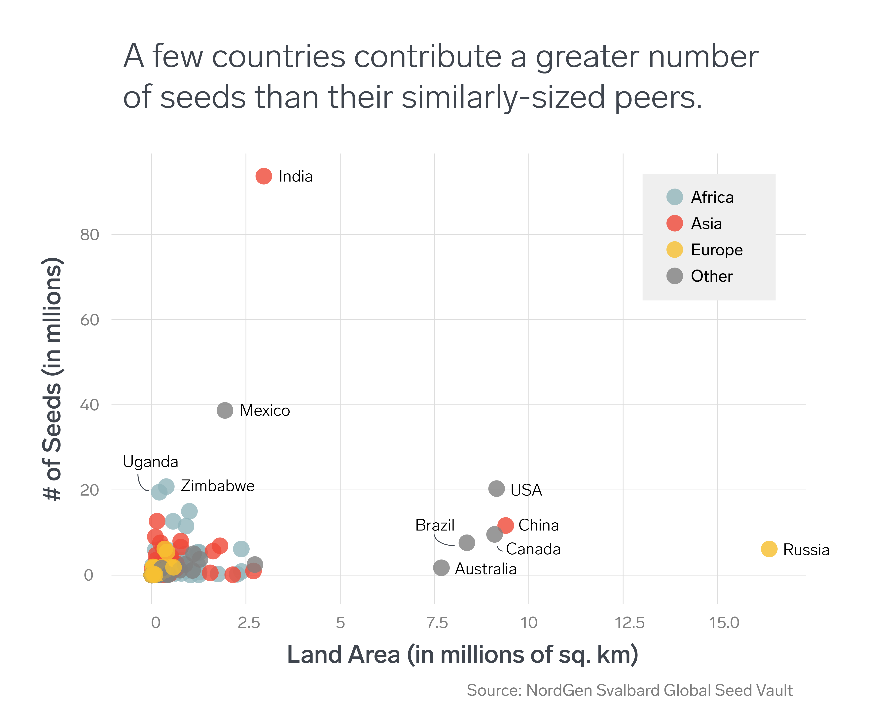

  

# WiMLDS NYC:  December 2017 Newsletter

## OUR MISSION

WiMLDS's mission is to support and promote women who are practicing, studying or interested in the fields of machine learning and data science.  We create opportunities for women to engage in technical and professional conversations in a positive, supportive environment by hosting talks by prominent data scientists, technical workshops, networking events and hackathons.  We are inclusive to anyone who supports our cause regardless of gender or technical background.  However, in support of our mission, priority for certain events and opportunities will be given to women.  

Our [Code of Conduct](https://github.com/WiMLDS/starter-kit/wiki/Code-of-conduct) is available online and applies to all our spaces, both online and off.

---

## UPCOMING EVENTS
### [Diversity of Backgrounds: A Career Transition into Engineering](https://www.bloomberg.com/event-registration/?id=72909), Tues Dec 5 at 6 PM
ANITAB.org New York and Bloomberg Women in Technology (BWIT) invite you for a panel discussion in which five software engineers from Bloomberg share personal stories about their transition into the tech industry, as well as the unique value they bring from their professional journeys!  

## BLOGS 
[Anna Willoughby](https://www.linkedin.com/in/anna-willoughby/), by generous support of [PLOTCON](https://plotcon.plot.ly/), attended the Plotly in R Masterclass.  Check out her [blog](http://wimlds.org/anna-willoughby-plotcon-2017-plotly-masterclass/) which include her plots and links to resources!

## CONFERENCES 

### [12th Annual Machine Learning Symposium](https://github.com/WiMLDS/conferences/blob/master/2018/2018_03_09_ml_symposium.md) (New York Academy of Sciences) Mar 9, 2018  
Abstract submissions are invited for consideration for ten short "Spotlight Talks" as well as presentation in a **poster session**. For complete submission instructions, please visit our online portal. The deadline for abstract submission is **January 19, 2018.**

### More Conferences
Our running [list of conferences](https://github.com/WiMLDS/conferences) is available on GitHub.

## JOBS 

* [Assistant Professor in Statistics with Emphasis on Big Data](http://wimlds.org/job/simoin-fraser-university-2-assistant-professor-in-statistics-with-emphasis-on-big-data/), Simon Frasier University (Vancouver)

* For more job postings, visit our [Job Board](http://wimlds.org/jobs/)

## ENIGMA FEATURED DATASET 
On behalf of the [Between Two Rows](https://us5.campaign-archive.com/home/?u=04aa10cf99e0998bd8e69a109&id=e53dcad000) newsletter from [Enigma](https://www.enigma.com):  
The Svalbard Global Seed Vault's set of details on donated seeds. Check out the [source](https://www.nordgen.org/sgsv/index.php?page=sgsv_information_list) and the [data](https://public.enigma.com/datasets/svalbard-global-seed-vault-seed-samples/a44eb598-e372-4385-af38-d31606f27b19). The vault is nicknamed the "Doomsday Vault" and the dataset includes genus name, donation date and number of seeds in the collection.
  

---

## SLACK
We have a Slack team for female and non-binary members of WiMLDS.  If you would like to join and connect, send an email to slack@wimlds.org

## WiMLDS Website
For more information, visit our website at:  http://wimlds.org

